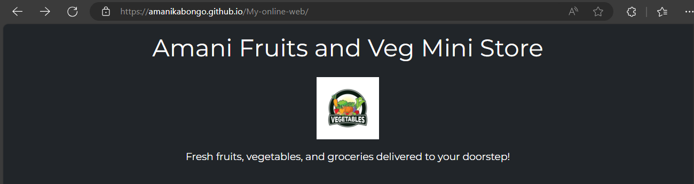
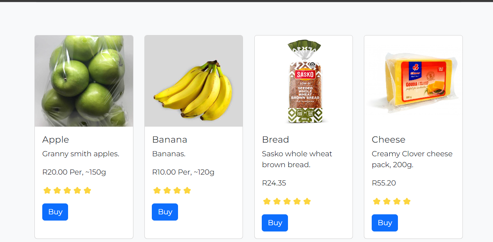
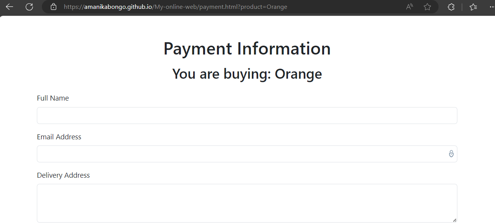
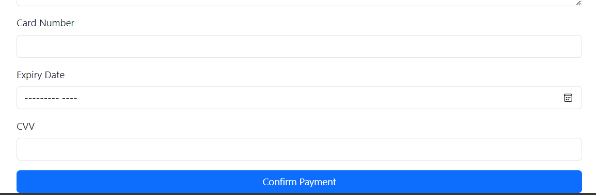
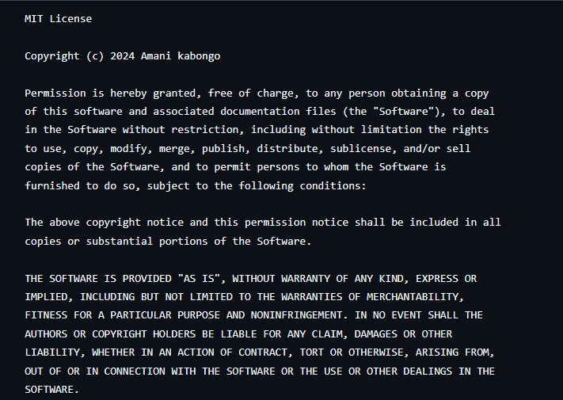

Amani Fruits and Veg Mini Store
Description
Amani Fruits and Veg Mini Store is a user-friendly online shopping platform for fresh fruits, vegetables, and groceries. Designed with simplicity and responsiveness in mind, the store allows users to browse products, add items to their cart, and proceed to a payment information page for a seamless checkout experience.

This project is ideal for small businesses or individuals looking to manage an online store without complex backend integrations. Its importance lies in providing a quick and affordable way to enter the e-commerce space while maintaining an excellent user experience.

# Table of contents 

Description

Features

Technologies Used

Installation

Usage

Screenshots

License

# Features
Responsive design using Bootstrap for accessibility on all devices.

A dynamic product catalog generated from JavaScript arrays for easy updates.

Redirection to a payment page with product details passed via URL parameters.

Integrated search bar for filtering products.

Lightweight and fast, with lazy-loaded images for optimized performance.

# Technologies Used
HTML5 and CSS3

JavaScript (ES6)

Bootstrap 5

Google Fonts

Font Awesome (for icons)

# Installation
To run this project on your local machine:

**1.Clone the Repository**

   

   <pre>
   <code id="codeBlock">
   git clone https://github.com/amanikabongo/My-online-web.git
   cd My-online-web
   </code>
   </pre>
   <button onclick="copyCode()">Copy Code</button>
   

   

# Using Python:
python3 -m http.server 8000

# Or using Node.js (with http-server installed globally):
npx http-server .
Open in Your Browser Visit http://localhost:8000/shoppingpage.html  view the project.

# Usage
After installing and running the project, here’s how you can interact with it:

# Home Page (Shopping Page)

# Browse through the dynamic list of products.

# Click the "Buy" button to proceed to the payment page.

# Payment Page

View the product name dynamically passed from the shopping page.

Fill out your delivery and payment details.

(This is a static demo, so payments aren't processed.)

Screenshots
Home Page
Users can view products with descriptions, ratings, and prices:

Payment Page
After clicking "Buy," users are redirected to the payment page:

# ULR For my repository 
**https://github.com/Amanikabongo/My-online-web**

# License
This project is licensed under the MIT License. You are free to use, modify, and distribute the code as long as proper credit is given.
